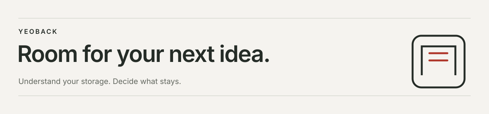

<picture>
  <source media="(max-width: 600px)" srcset="docs/github/images/yeoback-cover-mobile.svg">
  
</picture>

# Yeoback

**A calmer way to understand your storage.**

Find what is taking up space. Review what will change. Keep the decision yours.

**macOS · SwiftUI · Local data · Development preview**

[Design case study](docs/github/CASE-STUDY.md) · [Build the app](#start-here) · [Engineering](docs/github/ARCHITECTURE.md)


*The native Mac workbench with disposable fixture files. Selection, file evidence, and the review action stay visible together.*

<details>
<summary><strong>See the native dark appearance</strong></summary>


Ivory, evergreen, and coral carry across both appearances. System, Light, and Dark can be selected in Reserve settings or the native Appearance menu. See the [design contract](docs/github/DESIGN.md) for tokens and capture limitations.

</details>

## Make room, with context

Storage cleanup is a decision about someone's work. A filename can suggest a leftover; it cannot establish that a file is safe to remove. Yeoback keeps that distinction visible through the whole flow.

**Measure → Find → Filter → Select → Review → Clean → Check the result**

| Understand | Decide | Follow through |
| :--- | :--- | :--- |
| Read measured capacity, compare folder growth, and set a reserve target. | Search documents, inspect paths and clues, then review your exact selection. | See individual outcomes, actual Trash destinations, and interrupted operations. |

Nothing is selected automatically. Hidden selections are disclosed during review, and each candidate is revalidated before cleanup. **Moving files to Trash usually does not free disk space yet.** Selected bytes are never presented as recovered space, and Trash is never emptied automatically.

## Design decisions that reach the implementation

Yeoback takes its name from **여백**, the room around what matters. That idea shapes both the quiet interface and the pause before cleanup.

**Evidence belongs beside the action.** File paths, eligibility, selection counts, and consequences share the workbench. Filters help narrow the list without concealing the existence of selected items.

**A reserve is a target.** Measured free space, candidate estimates, and the remaining gap have different meanings. The interface preserves those meanings instead of promising a future capacity result.

**Interruption needs an honest outcome.** Cleanup runs in bounded batches. Pending paths are saved before each batch; an interrupted operation is disclosed on relaunch and is never automatically replayed.

[Read the case study →](docs/github/CASE-STUDY.md) The problem, visual direction, implementation choices, and evidence still needed.

## A Mac app, with mobile explorations

The Mac app is the main implementation. It includes document review, eligible application removal, supported **uv** and **pip** cache cleanup, folder growth comparisons, activity, and a monitored reserve. Other detected cache stores remain informational. Optional on-device AI explains measured trends on compatible Macs; it has no deletion tools.

The **iPhone and Android development previews** explore the same review principles within folders chosen through the operating system. Mobile cleanup and recovery differ from the Mac app; system Trash and Undo are not guaranteed. These previews are not general device cleaners.

[Mobile scope and builds](mobile/README.md) · [Editable mobile flows in Figma](https://www.figma.com/design/olCrS1PxKWJjMiVlGbC3zR?node-id=233-465)

## Start here

**Mac local preview: 0.3.4 (8).** Recorded runtime verification covers Apple Silicon on macOS 26.5.2. The deployment target is macOS 14; older macOS versions and Intel runtime behavior remain unverified. Building requires an Apple toolchain with the macOS 26 SDK for Foundation Models APIs.

```sh
git clone https://github.com/EricEremos/Yeoback.git
cd Yeoback
zsh scripts/build-app.sh
open dist/Yeoback.app
```

There are **no external Swift package dependencies** and no privileged helper. This creates an ad-hoc signed local app, not an Apple-notarized public release.

[First cleanup, filters, shortcuts, and local installer →](docs/github/GETTING-STARTED.md)

## Quality you can inspect

```sh
zsh scripts/check-all.sh
```

The [quality report](docs/github/QUALITY.md) records automated checks, native UI observations, and remaining gaps separately. Coverage includes disposable-file operations, changed-file refusals, mixed batches, interrupted-state recovery, process locking, provider timeouts, forecasts, and growth. Mobile evidence covers simulator and emulator fixtures; physical-device and real cloud-provider behavior remains unverified.

The current evidence does not establish participant-validated usability, a complete accessibility audit, or public-release readiness.

## Explore the project

| For a closer look | Read |
| :--- | :--- |
| Product reasoning and design tradeoffs | [Case study](docs/github/CASE-STUDY.md) |
| Components, ownership, and recovery | [Architecture](docs/github/ARCHITECTURE.md) |
| Scope checks and cleanup boundaries | [Safety and privacy](docs/github/SAFETY.md) |
| Palette, typography, and appearances | [Implemented design contract](docs/github/DESIGN.md) |
| Rules drawn from 150 design explorations | [Design foundation](docs/DESIGN-FOUNDATION.md) |
| Changes over time | [Changelog](CHANGELOG.md) |

[Mac designs in Figma](https://www.figma.com/design/olCrS1PxKWJjMiVlGbC3zR?node-id=196-416) · [Typography and spacing](https://www.figma.com/design/olCrS1PxKWJjMiVlGbC3zR?node-id=210-465) · [Icon rationale](https://www.figma.com/design/olCrS1PxKWJjMiVlGbC3zR?node-id=185-417)

---

Created by [EricEremos](https://github.com/EricEremos). This is the main repository for Yeoback's ongoing development, source code, and design documentation. Earlier development history is preserved separately in a private repository. The app retains its development-preview status. See [contribution guidelines](CONTRIBUTING.md) and [security reporting](SECURITY.md) before proposing changes. Public visibility does not grant an open-source license.
