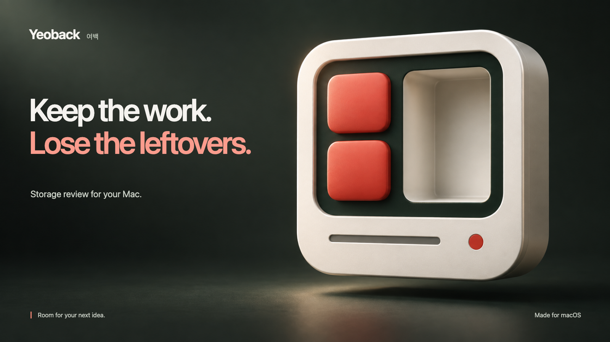
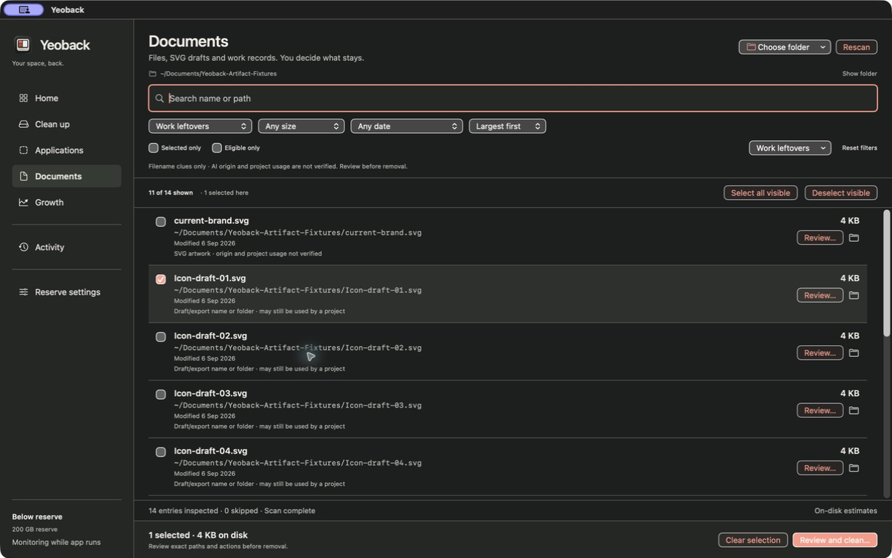

<picture>
  <source media="(max-width: 600px)" srcset="docs/github/images/yeoback-hero-mobile.png">
  
</picture>

# Yeoback

Review SVG drafts, work records, and developer caches. Choose what to remove. Keep what matters.

[**Build the Mac app →**](#start-here) &nbsp; [Explore the design](docs/github/CASE-STUDY.md)

Native SwiftUI · Local file analysis · Light & dark · Development preview


## From leftover files to a clear decision.

- **Find the trail.** Filter SVGs, drafts, exports, and work records by name, size, and date. Inspect the path and the reason each file appeared.
- **Clear the buildup.** Review files together, remove eligible apps, and clean supported **uv** and **pip** caches. See each operation's outcome.
- **Watch what grows.** Compare folder snapshots and monitor your free-space reserve. Optional on-device AI explains measured trends on compatible Macs.

You choose every file. Filename and folder clues suggest candidates; they do not prove AI origin or that a file is unused. **Moving files to Trash does not usually free space until Trash is emptied.** Yeoback never empties it automatically.

<details>
<summary><strong>After hours — the native dark appearance</strong></summary>



Choose System, Light, or Dark. Both appearances use the same review flow. [Colors, type, and spacing →](docs/github/DESIGN.md)

</details>

## A little more 여백.

Yeoback takes its name from the Korean word for the space around what matters. The icon leaves a bay open. The app leaves the decision with you.

[The design story](docs/github/CASE-STUDY.md) · [150 design explorations](docs/DESIGN-FOUNDATION.md) · [How it works](docs/github/ARCHITECTURE.md)

## Start here

**Mac development preview · 0.3.4 (8)**

Requires Xcode with the **macOS 26 SDK**. Builds target macOS 14+; recorded runtime checks cover Apple Silicon on macOS 26.5.2. This is a locally built, ad-hoc signed app, not a notarized public release.

```sh
git clone https://github.com/EricEremos/Yeoback.git
cd Yeoback
zsh scripts/build-app.sh
open dist/Yeoback.app
```

[First cleanup & shortcuts](docs/github/GETTING-STARTED.md) · [Safety & privacy](docs/github/SAFETY.md) · [Test evidence & known limits](docs/github/QUALITY.md)

<details>
<summary><strong>iPhone & Android previews</strong></summary>

Mobile previews review folders you explicitly choose. They cannot clean the whole device, and system Trash or Undo is not guaranteed.

[Builds and platform scope](mobile/README.md) · [Mobile flows in Figma](https://www.figma.com/design/olCrS1PxKWJjMiVlGbC3zR?node-id=233-465)

</details>

---

Built by [EricEremos](https://github.com/EricEremos). [Changelog](CHANGELOG.md) · [Contributing](CONTRIBUTING.md) · [Security](SECURITY.md)

Screens show sample files from the 0.3.4 preview. [Artwork credits](docs/github/marketing/README.md). Source is public; no open-source license is granted.
