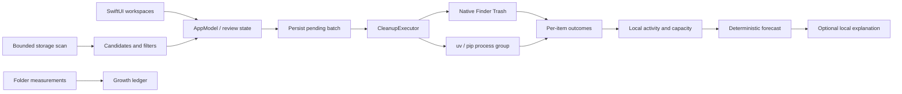

# Engineering Yeoback

Yeoback is a SwiftUI executable with AppKit integration for native Trash, folder selection, Finder reveal, and application lifecycle. There are no external package dependencies or privileged services.

## Ownership and invariants

| Component | Responsibility |
| --- | --- |
| `Storage.swift` | Capacity readings, bounded scans, candidate identities, scope checks, native Trash validation. |
| `Inventory.swift` | Search, filters, sort order and visible-selection semantics. |
| `AppModel.swift` | Review snapshots, lifecycle transitions, journals, results and bounded persistence. |
| `CleanupExecutor.swift` | Document batching and isolated provider operations. |
| `CacheCleanup.swift` | Fixed provider roots, executable selection, deterministic arguments and bounded subprocess lifecycle. |
| `GrowthLedger.swift` | Comparable allocated-byte measurements and recurrence evidence. |
| `StorageForecast.swift` | Deterministic trend assessment; withholds unsupported predictions. |
| `LocalStorageAdvisor.swift` | Optional on-device explanation with no filesystem mutation tools. |
| `AppDelegate.swift` | Single-writer application lock and quit guard during cleanup. |

The main actor owns presentation and state transitions. Filesystem work runs outside the UI actor. Document batches contain at most 32 items. Results preserve individual success/failure; the inventory is reconciled once at completion. Stop means **finish the active batch, then stop**. A provider operation can remain active until its timeout and termination grace complete.

Before a batch starts, its paths are atomically saved. Outcomes and a cleared pending record are saved afterward. Failure to save the initial recovery record prevents cleanup. Relaunch with pending paths opens Activity and requests inspection of original locations and Trash. This is an uncertainty record, not a transactional filesystem rollback or automatic retry queue.

Partial same-folder scans retain unseen earlier results because an incomplete scan cannot prove absence. A changed folder resets scope. A complete scan replaces old results. Every cleanup operation revalidates its candidate regardless of how the row entered the inventory.

Provider execution uses `posix_spawn`, a dedicated process group, explicit environment, `/` working directory, `/dev/null` input, a nonblocking pipe, 8 KiB captured output, and bounded drain passes. Timeout terminates the group with TERM then KILL. Remaining group descendants are also stopped after parent exit. A descendant that deliberately escapes the process group is outside this guarantee; installed providers are trusted local tools, not sandboxed untrusted programs.

## Data and privacy

`~/Library/Application Support/Cleanup/state.json` holds the reserve, up to 180 capacity readings, up to 100 activity records, and at most one active batch's pending paths. `growth.json` holds up to twelve measurements for each of three folders. `application.lock` coordinates normal app instances. The historic Cleanup directory and bundle identifier remain stable across branding changes.

No telemetry or cloud upload is implemented. Activity and recovery records contain paths. Optional AI uses a qualitative, bounded evidence prompt; it neither chooses files nor authorizes cleanup. The deterministic data remains usable without Apple Intelligence.

## Build and validation

Use `zsh scripts/check-all.sh` for the local suite, `zsh scripts/build-app.sh` for the app, and `zsh scripts/package-app.sh --skip-build` for the DMG. CI uses the explicitly selected [GitHub macOS 26 image](https://github.com/actions/runner-images/blob/main/images/macos/macos-26-Readme.md), whose toolchain includes the required SDK. GUI acceptance and real AI availability are separate from hosted tests.
