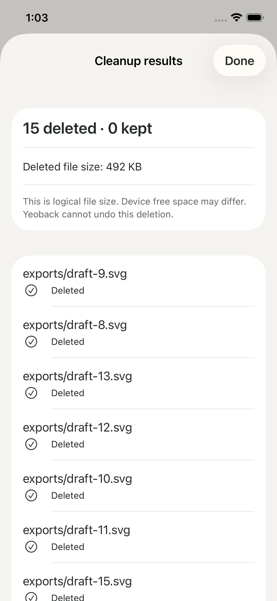
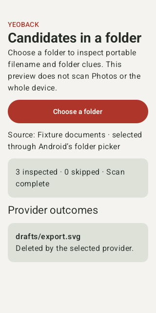

# Yeoback: making room for a considered decision

[← Project overview](../../README.md) · [Design contract](DESIGN.md) · [Engineering](ARCHITECTURE.md)

**A product design and native engineering case study, in progress.**

Yeoback explores how a storage utility can help someone act with a clear understanding of what will change. The work spans interaction design, a shared visual foundation, a native Mac implementation, and scoped iPhone and Android previews. This account documents design reasoning and observed implementation evidence; participant usability research remains future work.

*Current Mac light appearance, using disposable fixture files. The capture shows an implemented workbench rather than a concept screen.*

## The problem: finding a file is only the first decision

A large file is not necessarily expendable. A small SVG may be a current asset; a draft or session record may hold valuable work. Even a successful move to Trash does not necessarily increase free space. A cleanup interface has to explain the evidence available without implying knowledge it does not have.

The design objective is to keep three questions answerable: **What did the app find? What am I authorizing? What actually happened?**

These are product hypotheses and design constraints, not findings from participant interviews. The [safety contract](SAFETY.md) defines the implemented boundaries.

## 01 / Keep evidence close to the decision

The Documents workbench combines scope, search, filters, file paths, selection, and review. Work leftovers presets expose filename and folder clues, including small files missed by a large-file-only view. The copy explains that AI origin and project usage are not verified.

Filtering does not silently discard selections. Review discloses selected items hidden by the current filter, and **Select all visible** covers matching eligible results below the viewport. This creates a useful tension: the interface needs to be compact enough to scan while leaving enough room to inspect exact paths.

The current solution uses aligned columns, restrained separators, and a persistent action area. A future usability study should test whether people correctly understand selection after changing filters; the implementation checks alone cannot answer that question.

## 02 / Give different numbers different meanings

Measured free space, candidate estimates, conditional possible space, a user target, and a remaining gap are separate concepts. The capacity model preserves those distinctions. A reserve expresses the space someone wants to keep available while the app is open; it grants no authority to delete.

This choice carries into outcome reporting. Yeoback records individual results and refreshes capacity rather than calling selected bytes “recovered.” It does not empty Trash automatically.

The [foundation rules](../DESIGN-FOUNDATION.md) retain the rationale, counterexamples, and provenance. Numbers in the design studies are illustrative, not current measurements or achieved outcomes.

## 03 / Make the pause operational

Review is a state with a concrete selection. Execution rechecks candidates because a file may have changed since scanning. Cleanup then runs in batches of up to 32 documents, with provider operations handled separately.

| Moment | Implemented behavior | Limit |
| :--- | :--- | :--- |
| Before a batch | Save pending paths; refuse to begin if that save fails. | A journal does not make filesystem operations transactional. |
| During cleanup | Retain per-item outcomes; allow stopping after the active batch. | Stop is not an instantaneous cancellation of every active operation. |
| After an interruption | Disclose pending paths on relaunch and ask for inspection. | No automatic replay or guaranteed rollback. |
| After completion | Reconcile inventory and report outcomes and measured capacity. | A move to Trash is not proof of recovered space. |

These constraints shape the interaction language. They also make recovery behavior inspectable in the [architecture](ARCHITECTURE.md), rather than leaving trust to visual styling.

## 04 / Build an identity around room to read

**여백** suggests the space around what matters. Ivory surfaces, evergreen text, and coral accents translate that idea into a quiet workbench. Swiss Index provides the typographic hierarchy and fine rules; spacing is used to distinguish controls, file evidence, and actions.

The foundation grew through **150 design explorations**. These are comparisons of structure, behavior, and finish, not 150 independently established philosophies. The selected direction combines I · Swiss Index, A navigation, and X20 capacity semantics. That is a project design decision, not participant validation or evidence of a universal preference.

*Native dark capture. The quality record notes that this capture preceded a subsequent menu-only styling correction; it is not evidence for every final visual detail.*

System, Light, and Dark appearances preserve the task structure. The [implemented design contract](DESIGN.md) records palette values, typography, spacing, and measured contrast limits. [Figma](https://www.figma.com/design/olCrS1PxKWJjMiVlGbC3zR?node-id=196-416) retains the editable design work.

## 05 / Carry the principle across platforms

Mobile previews carry forward deliberate selection and review while accepting a smaller access scope: folders explicitly chosen through the operating system. The iPhone implementation uses SwiftUI and coordinated file access; Android uses Compose and the Storage Access Framework.

  
  

*Captured mobile fixture outcomes. The platforms have different recovery behavior; neither preview guarantees system Trash or Undo.*

The mobile work tests whether the decision sequence survives platform constraints. It does not establish whole-device cleanup, physical-device reliability, or compatibility with every cloud document provider. [Scope and verification details](../../mobile/README.md) are part of the preview, not release fine print.

## What the evidence supports today

| Area | Recorded evidence | What it does not establish |
| :--- | :--- | :--- |
| Mac behavior | Disposable-file checks, refusal paths, batching, recovery records, provider lifecycle, forecasting, and growth checks. | Every filesystem condition or compatibility with older Macs. |
| Native interface | Fixture scans, filtering, selection across the list, review, and appearance observations. | Participant-validated usability or a complete accessibility audit. |
| Visual system | A token contract and measured text/background pairs. | Accessibility of every state and interaction. |
| Mobile previews | Simulator and emulator fixture tests and captures. | Physical-device and real cloud-provider behavior. |

The [quality report](QUALITY.md) is the source for test counts, capture timing, and release limitations. These are existing project records, not claims that all product tests were rerun for this case study.

## What comes next

Before a broader release, the highest-value work is to close gaps that could change a user's decision or outcome:

- Observe people using filters, hidden selections, review, and interrupted-state recovery; revise language where their interpretation differs from the implemented behavior.
- Complete keyboard and assistive-technology checks, including VoiceOver, alongside minimum-window and appearance verification.
- Extend runtime evidence to older supported macOS versions, Intel where applicable, physical mobile devices, and real document providers.
- Resolve distribution signing, notarization, and licensing before presenting a public release as ready to install. Public source visibility alone does not establish distribution readiness.

The portfolio value of Yeoback lies in the connection between a visual decision and the behavior it governs. The case study will grow with the evidence: decisions made, limitations found, and changes verified.

---

[Build the Mac preview](../../README.md#start-here) · [Inspect the source architecture](ARCHITECTURE.md) · [Read the quality record](QUALITY.md)
