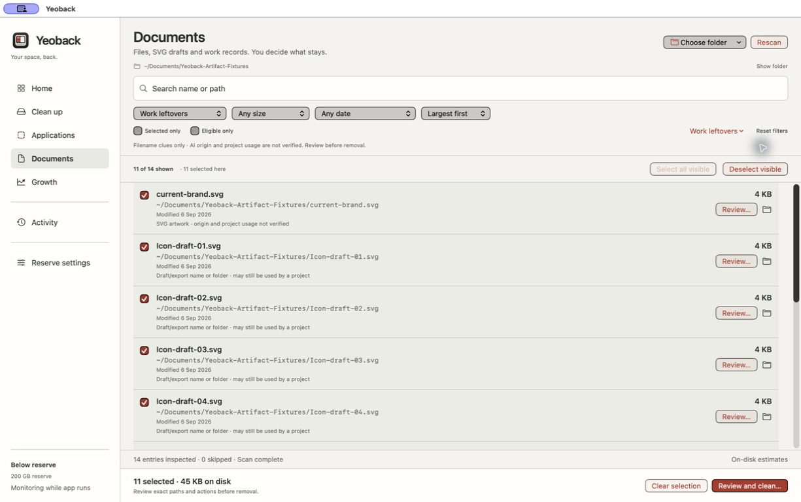
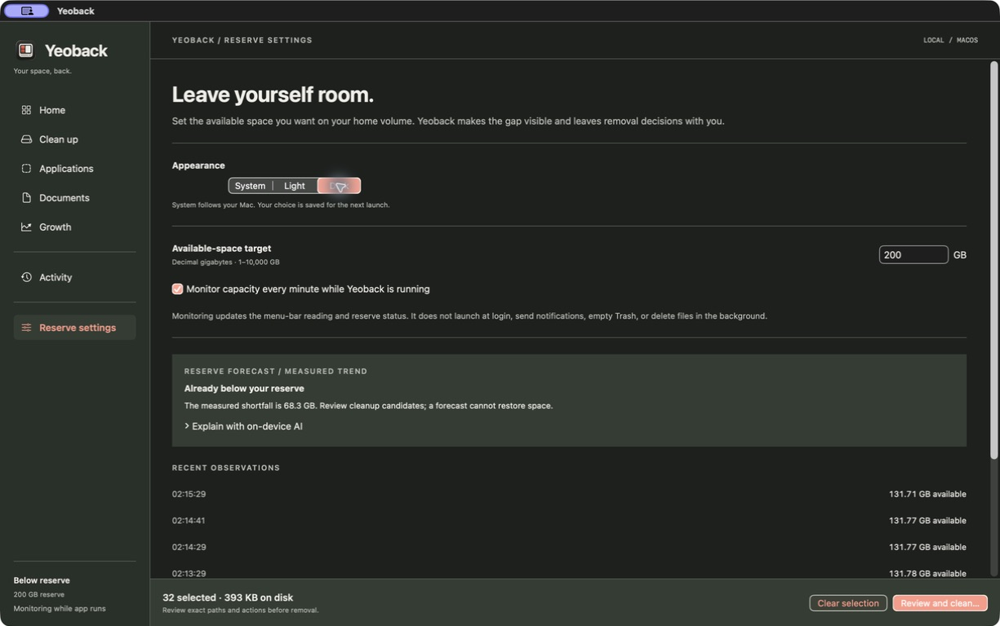

# Quality evidence

## Source update · 2026-09-08

The integrated source update passed `zsh scripts/check-all.sh` and `zsh scripts/check-mobile-core.sh` during implementation. The recorded execution covers filesystem self-checks, batched cleanup fixtures, lifecycle/recovery, providers, cache inventory, forecasts, growth, and the iOS folder-engine core. These runs were observed in the implementation session; full terminal logs were not retained as repository artifacts.

A subsequent `zsh scripts/build-app.sh` completed and produced an ad-hoc signed local app. This update has not been reinstalled over the user's existing app. New cache inventory was tested with fixtures; this does not establish live results across every personal cache store or cloud provider. The mobile core check is not a full iPhone build or physical-device test.

The desktop and portrait brand covers were visually inspected. The six-second, 1080p film was inspected across sampled frames and played to completion in a browser. These checks establish media delivery, not app usability or cleanup correctness. README app screenshots remain from the 0.3.4 preview below; they are not evidence of the updated native layout.

## Installed preview evidence · 0.3.4 (8)

The installed 0.3.4 build passed **108 assertions**: 40 filesystem/artifact, 12 batch, 23 release/lifecycle, 7 provider, 16 forecast and 10 growth. Six new checks cover small SVG discovery, case-insensitive filtering, filename false positives, work records, draft uncertainty and a real SVG Trash move followed by restoration. A subsequent menu-contrast correction passed a release build and native Light inspection; it did not change storage logic.

Native fixtures contained 14 small files. Scanning inspected all 14, skipped none and completed. Work leftovers displayed **11 of 14**: eight draft SVGs, one other SVG and two work records. Ordinary configuration, meeting notes and `draftsmanship.txt` were excluded by this preset. Search narrowed to one draft SVG; keyboard selection and `⌘K` opened its exact-path review. Cancel retained selection. Clearing search restored eleven candidates, and Select all selected all eleven, including those below the viewport. No personal documents were removed.

Both themes were visually inspected. The Dark screenshot precedes the final menu-only styling correction; the Light screenshot includes it. Final minimum-window testing was interrupted when the Mac locked and automatic unlock failed. Expanded-window evidence does not establish compact-window behavior.

The 18 text/surface contrast pairs were recalculated after changing the dark palette: minimum **4.72:1**. Existing Figma Documents and Reserve references and the design contract were updated; render inspection corrected an oversized Finder label that hid its adjacent Review action. These remain authored design decisions, not participant validation.

The final app passed local signature verification; the installed executable matched the packaged source app. The DMG passed `hdiutil verify`. Reserve settings survived the update.

```text
0.3.4 executable SHA-256
1a633fd50db276eb63c14c52a455f7dd5dca059be87cd1e84e85eff93e195e4a
Yeoback-0.3.4-arm64-local.dmg SHA-256
c1a71f6e549db189721e6023c4c66e486d032c4378eb574420093263611ace37
```

## Historical evidence · 0.3.3 (7)

The following observations belong to 0.3.3. Markdown is now supported; the old extension counts and executable hashes below describe that earlier build. Current screenshots are shown for the present interface, not as records of the earlier fixture operation.

Evidence recorded on 6 September 2026. The app is a local preview, not a certified or notarized public release. No numerical UX score is claimed.

## Automated and build evidence

`zsh scripts/check-all.sh` passed **102 assertions** on the adaptive-theme implementation: 34 filesystem, 12 batch, 23 release/lifecycle, 7 provider, 16 forecast, and 10 growth assertions. The final typography changes then passed a release build and native UI checks. The suite was not rerun merely to regenerate an unchanged receipt.

Coverage includes changed-file refusal, mixed batch outcomes, interrupted pending-state disclosure, failure to persist recovery state, instance locking, bounded provider output and deadlines, deterministic forecasts, and measured folder growth. Interrupted-state tests seed saved state; they do not simulate a real machine crash during filesystem mutation.

The installed and packaged executable hashes matched:

```text
SHA-256 executable
544013b1c3cb8f56c222146fdc7567e347a252cc0ba63079d241cea716fdf640

SHA-256 Yeoback-0.3.3-arm64-local.dmg
52bf16c71aa46dde7651050646a68374757c0809e59b8ebd4b98a0a234bf36eb
```

The DMG passed `hdiutil verify`. The app uses ad-hoc local signing. The package was rebuilt from `90358c8` after a fixture-only correction: an explicitly typed directory URL keeps mock uninstall validation consistent when `~/Applications` does not yet exist. All 34 filesystem/provider self-check assertions passed locally after that correction. Production uninstall permissions were unchanged. Native screenshots and interactive scenarios below preceded this fixture-only rebuild; installed/package hash parity was checked again afterward. Remote CI results are recorded separately in GitHub Actions.

## Observed in the installed native app

The test folder contained 64 task-created files: **32 eligible TXT files** and 32 MD files excluded by the existing document extension allowlist. No personal documents were used.

1. A search produced nine matching files. Select all selected all nine.
2. A different search displayed ten files and no selected rows in that view; the footer still disclosed the nine hidden selections.
3. `⌘K` reviewed the exact nine selected paths. Cancel preserved the selection.
4. Clearing the filter and selecting all selected all 32 eligible files.
5. The final installed build reviewed those 32 fixture paths and moved them to Trash. Activity reported **32 completed, zero needing attention**.
6. Capacity remained approximately 131.77 GB. The small measured delta reflected concurrent writes, and the app correctly explained that Trash is not recovered space.
7. Each recorded Trash destination was checked against the task fixture directory. All 32 files were restored and their SHA-256 hashes matched the originals. Rescanning and full selection worked again.
8. Light and Dark rendered in the native app. `⌘F` focused search with a visible outline. Dark persisted after quit and relaunch; the existing 200 GB target and monitoring setting remained intact. The System option could also be selected.




## Visual and design evidence

- Native screenshots were captured from the final typography build, not a browser mockup.
- Eighteen solid text/surface color pairs passed 4.5:1; minimum 4.72:1. This is a palette check, not a complete accessibility audit.
- Current light/dark Documents and Reserve references and a design contract were updated in the existing Figma release section. Render inspection caught and corrected stretched horizontal auto-layout groups and a clipped action column.

## Remaining limits

- No participant usability study or full VoiceOver audit has been completed.
- Final 0.3.3 minimum-window-size behavior was not verified; earlier layout checks belong to their original version.
- Native runtime evidence is from Apple Silicon on macOS 26.5.2. macOS 14/15 and Intel runtime behavior remain unverified.
- Provider process-group termination is containment, not a sandbox. A child that deliberately escapes its group is outside that mechanism.
- The toolchain reports a deprecation warning for the provider working-directory spawn API on macOS 26; this is not a build failure.
- Foundation Models availability depends on the Mac and system configuration. Deterministic measurements work without it; explanatory AI has no removal authority.
- Reserve monitoring runs while Yeoback is open. It neither guarantees free space nor automatically removes user files.

The next release gates are broader OS/device testing, full accessibility and compact-window checks, participant task observation, and Apple signing/notarization for distribution.
