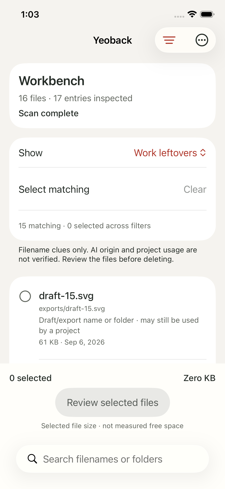
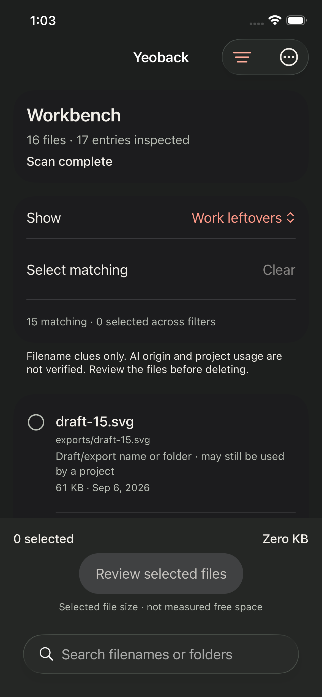
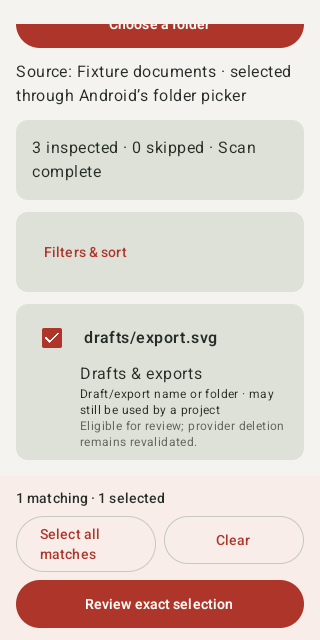
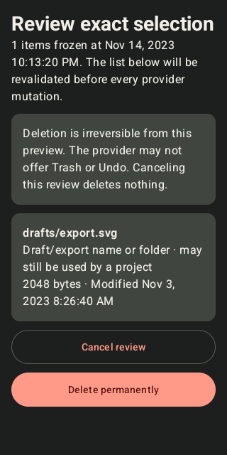

# Yeoback mobile preview evidence

> Historical development record: this document predates the public portfolio snapshot. Earlier commit IDs and CI run numbers refer to private development evidence and are not publicly retrievable. For new runs, see the [public workflows](https://github.com/EricEremos/Yeoback-portfolio/actions).

This record separates native execution, fixture coverage and unverified provider
behavior. It is not a numerical quality score or a store-release claim.

## Verified baseline

The installed Mac application was preserved. The shared filename/path classifier
was extracted without changing its rules; `scripts/check-all.sh` passed after
that extraction. The log is retained locally at
`.build/mobile-mac-regression.log`.

The iOS file engine's local temporary-file driver passed after replacing eager
directory listing with bounded lazy enumeration. It scanned and filtered a real
temporary folder, refused a changed file, removed an unchanged reviewed file,
and preserved the original. This is a macOS execution of the portable engine,
not proof of iOS document-provider permission behavior.

Native CI run 34033602243 (private development CI)
at `2e6da42a03d5d861e6beb2d29a36675fac8dee97` passed the iOS job: five engine
tests and two UI tests. The latter selected all 15 fixture candidates, opened
review, canceled without losing selection, acknowledged deletion, and observed
15 deleted results. Light/Dark inventory and result screenshots were inspected.
The Android job failed compilation at that revision; it is not a passing
cross-platform baseline. Subsequent source verification is recorded below.

## Design evidence

Eight editable, vertical Auto Layout frames are present in the existing
[Figma mobile section](https://www.figma.com/design/olCrS1PxKWJjMiVlGbC3zR?node-id=233-465).
They cover inventory, filters, review and results in both appearances. Each is
390 × 1040 and uses the existing semantic color collection. Read-only bounds
inspection found no overflow among their immediate visible children. This does
not establish native rendering, nested text fit, accessibility or user validation.

## Final-source verification

The final iOS source passed on
run 34034692703 (private development CI),
revision `45721841e940f9f9feec7f9f58cbb274fb6eb029`: five engine tests and two
UI tests, zero failures. The iPhone 16e simulator screenshots show Light/Dark
inventory, a persistent selection/review area, and the final 15-deleted outcome
with the explicit logical-size/recovery limits. The inspected copies are
`docs/mobile-preview/iphone-light.png`, `iphone-dark.png`, and
`iphone-results.png`. Subsequent Android-only changes do not alter those iOS
inputs. Android revision `99a2b50d8f81b76fe005ab7932f82dc486337010`
passed all 12 JVM tests and built both debug APKs on
run 34034977201 (private development CI).
After correcting the platform-tools PATH and giving the AVD manager and emulator
one explicit directory, run
34036134072 (private development CI)
booted Android 15 and executed seven connected tests. Six passed, including both
provider tests, the selection/review/cancel/confirmation flow, launch and unknown
metadata. The Light surface assertion failed at an offscreen candidate. This
was not a passing complete Android run.

Revision `2eb7b2a83ddacb22ddb06b624c43d224a7cc0579` scrolls to the candidate,
separates candidate/result list keys for retained files, exercises a retained-file
outcome, and preserves test installation until screenshot export. Its native run
is 34036828318 (private development CI);
all 12 JVM and seven connected tests passed. Visual inspection nevertheless
found unreadable dark review cards. That run is retained as counterevidence:
text-presence assertions alone did not establish a usable Dark appearance.

Revision `e5945b6bc2e39608c196b115291ad6856dd5045a` defines all neutral
Material surface-container roles in both schemes, gives review an explicit
background/content-color pair, and checks rendered dark canvas/card luminance
and card text contrast. Its native verification is
run 34037492012 (private development CI).
Both native jobs passed at that exact revision: iOS five engine and two UI
tests; Android twelve JVM and seven connected tests; zero failures. Fresh Android
captures were inspected: dark review has dark canvas/cards and readable labels,
Light inventory retains selection/review controls while scrolled, and the result
surface displays a provider outcome. The new luminance and contrast assertions
passed. This is a verified private preview, not a full accessibility certification.

## Observed iPhone screens

These are native simulator captures, not Figma renders. The inventory is a
disposable local fixture. The result belongs to the UI-driven 15-file deletion
test; it does not represent personal files or measured recovered disk space.

| Light inventory | Dark inventory | Deletion result |
|---|---|---|
|  |  |  |

## Observed Android screens

These are native Android 15 emulator captures from final run 34037492012. The
Light inventory is intentionally scrolled to the selected candidate. The result
is a static fixture for outcome rendering; actual provider mutation and changed-
file rejection are verified by separate connected tests, not by that screenshot.

| Scrolled Light inventory | Dark exact review | Outcome rendering fixture |
|---|---|---|
|  |  |  |

## Practical limits

- Both apps inspect only the selected folder and available provider metadata.
  Filename/path clues do not prove AI origin, project usage or disposability.
- Logical selected/deleted bytes are not measured recovered device storage.
- Deletion has no Yeoback Trash or Undo guarantee and may synchronize to other
  devices. Recovery depends on the source/provider.
- Revalidation reduces stale-selection risk. It cannot guarantee behavior of an
  uncooperative provider or eliminate every external concurrent mutation.
- Scans stop between operations; an individual blocked provider call can outlast
  the scan's nominal budget. Partial coverage is displayed.
- Simulator/emulator fixtures do not establish iCloud, third-party providers,
  disconnected storage, real-device grants or provider recovery semantics.
- Physical-device signing/installation, store submission, VoiceOver/TalkBack
  traversal and the full device/font-size matrix remain outside verified evidence.
- No personal files are used for destructive tests; fixtures are disposable.
